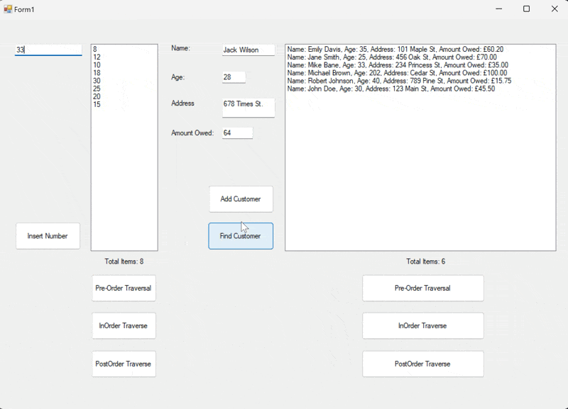

# Binary Search Tree Data Management
## Windows Form Application



## Project Overview

A binary search tree application developed using C# to manage Integer and Customer data.

## Features

- Add new integers and customers to the binary search tree
- Display the number of items in the tree
- Traverse the tree using PreOrder, InOrder, and PostOrder methods
- Store and manage customer objects within the tree
- Retrieve customer details by providing a name

## Technologies Used

- **Programming Language:** C#
- **Framework:** .NET Framework
- **IDE:** Visual Studio

## Getting Started

### Prerequisites

- Visual Studio 2019 or later

### Installation

1. Clone the repository:

   ```bash
   git clone https://github.com/suatkocar/BinarySearchTree.git
   ```

2. Open the solution file `Exercise2.sln` in Visual Studio.

3. Build and run the project from Visual Studio.

## License

This project is licensed under the MIT License - see the [LICENSE.md](LICENSE.md) file for details.

## Contact

For any inquiries, please contact me at suatkocar.dev@gmail.com.